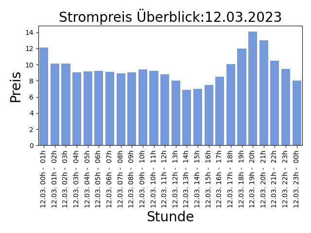

## Strompreise für den 02.04.2022

Niedrige Preise deuten auf viel Sonnen und Windenergieerzeugung hin, ein hoher Anteil an erneuerbaren Energien bedeuted weniger CO2 Verbrauch!

| Stunde | Preis in Cent/kWh |
|---|---|
| **02.04. 00h -  01h** | **11.201** | 
| 02.04. 01h -  02h | 12.501000000000001 | 
| 02.04. 02h -  03h | 13.172 | 
| 02.04. 03h -  04h | 14.053999999999998 | 
| 02.04. 04h -  05h | 13.178999999999998 | 
| 02.04. 05h -  06h | 14.507 | 
| 02.04. 06h -  07h | 13.584 | 
| 02.04. 07h -  08h | 16.806 | 
| 02.04. 08h -  09h | 19.03 | 
| 02.04. 09h -  10h | 19.215 | 
| 02.04. 10h -  11h | 16.977 | 
| 02.04. 11h -  12h | 16.694 | 
| 02.04. 12h -  13h | 16.063 | 
| 02.04. 13h -  14h | 13.218 | 
| 02.04. 14h -  15h | 12.059999999999999 | 
| 02.04. 15h -  16h | 12.844999999999999 | 
| 02.04. 16h -  17h | 13.745 | 
| 02.04. 17h -  18h | 17.127000000000002 | 
| 02.04. 18h -  19h | 22.759999999999998 | 
| 02.04. 19h -  20h | 25.915 | 
| 02.04. 20h -  21h | 24.163 | 
| 02.04. 21h -  22h | 21.0 | 
| 02.04. 22h -  23h | 20.613999999999997 | 
| 02.04. 23h -  00h | 18.938 | 

Preise der EPEX Spot ® Strombörse (neue Preise werden täglich um 14:00 veröffentlicht für den kompletten nächsten Tag).

letzte Aktualisierung:01.04.2022 14:30