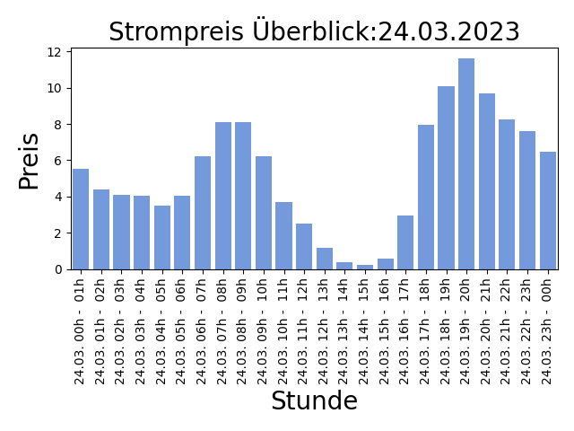

## Strompreise für den 06.10.2022

Niedrige Preise deuten auf viel Sonnen und Windenergieerzeugung hin, ein hoher Anteil an erneuerbaren Energien bedeuted weniger CO2 Verbrauch!

| Stunde | Preis in Cent/kWh |
|---|---|
| 06.10. 00h -  01h | 0.093 | 
| 06.10. 01h -  02h | 0.039 | 
| **06.10. 02h -  03h** | **0.01** | 
| 06.10. 03h -  04h | 0.049 | 
| 06.10. 04h -  05h | 0.05 | 
| 06.10. 05h -  06h | 3.601 | 
| 06.10. 06h -  07h | 9.01 | 
| 06.10. 07h -  08h | 14.809000000000001 | 
| 06.10. 08h -  09h | 14.911000000000001 | 
| 06.10. 09h -  10h | 7.297 | 
| 06.10. 10h -  11h | 6.29 | 
| 06.10. 11h -  12h | 0.923 | 
| 06.10. 12h -  13h | 0.8539999999999999 | 
| 06.10. 13h -  14h | 0.9039999999999999 | 
| 06.10. 14h -  15h | 3.3289999999999997 | 
| 06.10. 15h -  16h | 6.125 | 
| 06.10. 16h -  17h | 7.265000000000001 | 
| 06.10. 17h -  18h | 19.083000000000002 | 
| 06.10. 18h -  19h | 29.726999999999997 | 
| 06.10. 19h -  20h | 36.007999999999996 | 
| 06.10. 20h -  21h | 27.409 | 
| 06.10. 21h -  22h | 19.056 | 
| 06.10. 22h -  23h | 17.538 | 
| 06.10. 23h -  00h | 17.537 | 

Preise der EPEX Spot ® Strombörse (neue Preise werden täglich um 14:00 veröffentlicht für den kompletten nächsten Tag).

letzte Aktualisierung:05.10.2022 14:30